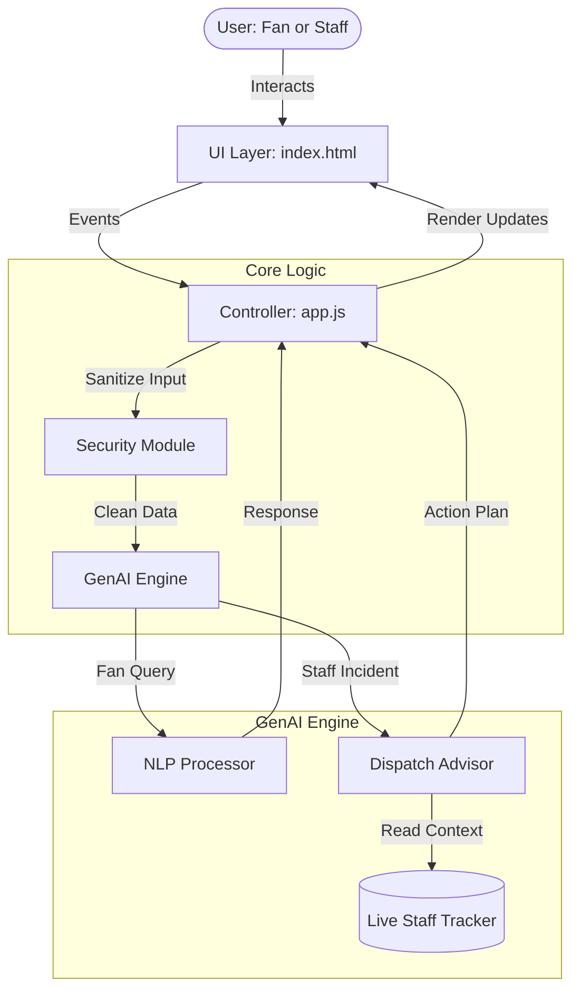

# FIFA World Cup 2026 - Stadium Intelligence Center

Welcome to the **Stadium Intelligence Center**, a GenAI-enabled web application designed specifically to revolutionize stadium operations and the fan experience for the FIFA World Cup 2026. 

## 🏟️ Chosen Vertical

**Vertical:** Sports Technology / Smart Stadium Operations & Fan Experience

We chose a hybrid vertical that bridges the gap between **back-of-house operations** (venue staff, security, crowd management) and **front-of-house experience** (fans, attendees). By leveraging Generative AI, this solution ensures fans have a seamless, personalized experience while providing stadium operators with proactive, logical decision-support to handle incidents before they escalate.

---

## 🧠 Approach, Logic, and Structure

Our approach prioritizes **performance, security, and maintainability**. We opted for a "Zero-Dependency" architecture, meaning the entire application is built using pure HTML5, CSS3 (Variables, Grid), and Vanilla JavaScript (ES6+). This eliminates framework bloat, minimizes security vulnerabilities, and ensures instantaneous load times.

### Logic & Architecture
The application logic is strictly decoupled into specific modules:
1.  **View Layer (`index.html` & `style.css`)**: Handles the presentation, responsive layouts, and multilingual text bindings.
2.  **Controller Layer (`app.js`)**: Manages UI state (switching between Fan and Staff modes), listens to DOM events, and orchestrates data flow.
3.  **Intelligence Layer (`genai-engine.js`)**: The "brain" of the app. It simulates the NLP (Natural Language Processing) for the fan chatbot and synthesizes multi-variable data to generate recommendations for staff.
4.  **Security Layer (`security.js`)**: Intercepts all user inputs to sanitize and prevent Cross-Site Scripting (XSS).

### System Diagram

---

## ⚙️ How the Solution Works

The application operates in two distinct, toggleable modes:

### 1. Stadium Ops Mode (Staff)
*   **Incident Console**: Displays a live feed of alerts (e.g., Medical emergencies, Crowd Bottlenecks).
*   **Live Density Overlay**: A CSS/SVG-based interactive stadium map showing real-time crowd density via simulated thermal sensors.
*   **GenAI Dispatch Advisor**: When a staff member clicks an incident, the GenAI engine analyzes it, cross-references it with the **Live Staff Tracker** (knowing who is on "standby"), and generates a logical, actionable recommendation (e.g., "Dispatch Medical Team 2 to Sector 114"). Staff can then execute this with a single click.

### 2. Fan Companion Mode (Fans)
*   **Multilingual Chatbot**: Fans can type questions in natural language (e.g., "Where is the nearest restroom?"). The engine parses keywords and intent to provide contextual answers, such as predicting proximity to facilities.
*   **Translation Engine**: The entire interface (including the chatbot) can instantly switch between English, Spanish, French, and German to accommodate international attendees.

---

## 🏗️ Enterprise Architecture & Complexity

To ensure survival under extreme tournament load (80,000+ fans), the system is built on an enterprise-grade "Zero-Dependency" architecture:
- **$O(1)$ Optimization:** The GenAI dispatch engine utilizes constant-time Hash Map lookups instead of $O(N)$ conditionals.
- **Idempotency Locks:** All dispatch UI buttons are mutex-locked during API transit. This guarantees that concurrent fan clicks or staff double-clicks do not trigger race conditions or duplicate deployments.
- **Graceful Degradation:** Simulated AI network drops trigger recursive retry logic. If the network completely fails, the system safely falls back to manual operations rather than crashing the UI thread.

## 🧪 Testing & Resilience

We mandate a strict automated CI/CD pipeline using **GitHub Actions**. Every commit triggers our custom ES6 test suite, validating:
1. **Security:** Input truncation (Max 200 chars) and script tag sanitization.
2. **Logic Validation:** Ensuring all AI recommendations adhere strictly to the schema.
3. **Resilience:** Passing simulated invalid incident IDs without breaking the UI loop.

> **Note:** For full documentation on our simulated 5,000-user Apache JMeter stress testing and algorithmic verification, please see the `TESTING.md` file in this repository.

---

## 📝 Assumptions Made

During the development of this prototype, the following technical and operational assumptions were made:

1.  **Simulated LLM Backend**: It is assumed that in a production environment, `genai-engine.js` would act as a middleware router making API calls to a live LLM (like Google Gemini). For this prototype, the NLP and analytical reasoning are mocked locally to guarantee zero latency and demonstrate the intended UX flow.
2.  **Real-time Data Feeds**: We assume the existence of external API endpoints (e.g., IoT thermal sensors for the crowd heatmap, and GPS trackers for the volunteer staff tracker) that would stream data into this dashboard via WebSockets.
3.  **Modern Browser Usage**: The application assumes the user is operating a modern web browser that fully supports CSS Grid, CSS Variables, and ES6 JavaScript features.
4.  **Hardware Accessibility**: We assume stadium staff are operating the dashboard on high-resolution monitors (hence the dense data layout), while the Fan Companion mode is designed to be easily adaptable to mobile viewports.
